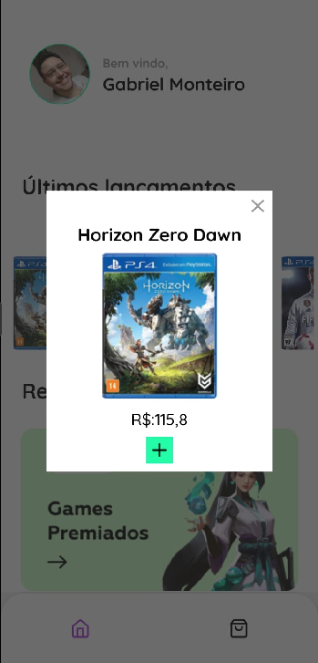

# gamestore

## Requirements

- Package manager: Yarn/Npm;
- Expo CLI(https://docs.expo.io/workflow/expo-cli/);
- Expo Client(https://expo.io/tools#client);
- React Native(https://reactnative.dev/docs/getting-started);

## Steps

- Use yarn/npm to install dependencies;
- Start the app with: 'expo start' or 'yarn start';
- Compatible plataforms :
  - Emulator:
    - Android Studio(https://developer.android.com/studio).
  - Smartphone:
    - Expo Client(install  from the store, open it and scan the 'QR Code').

## Features

- Add/remove cart's games ;
- List games;
- Show final price;

## Screenshots
### Main

## Cart

